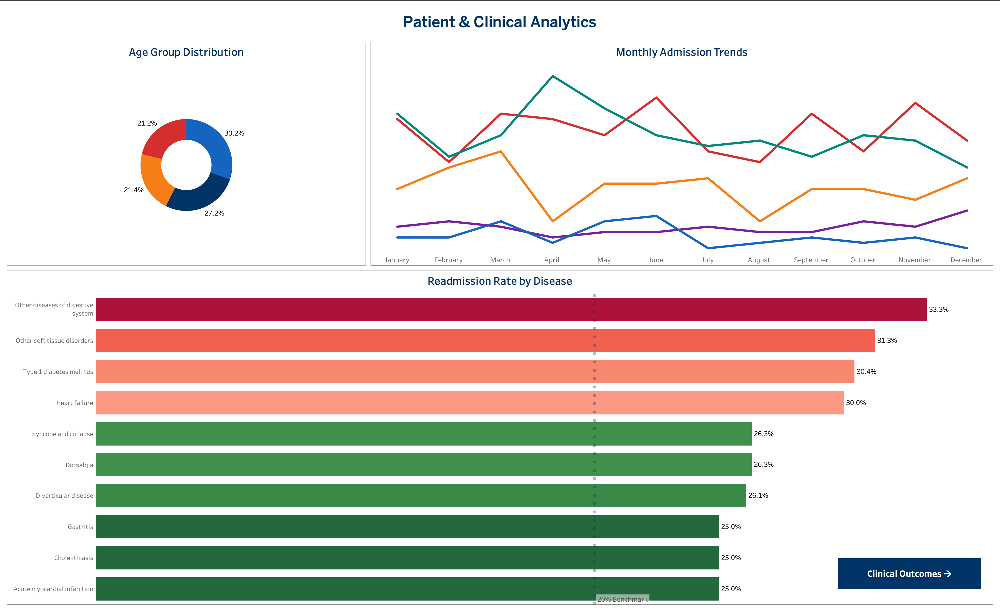
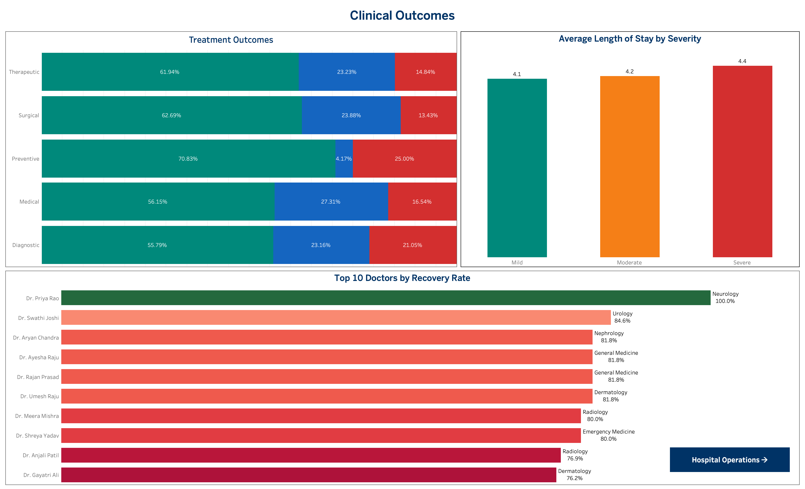
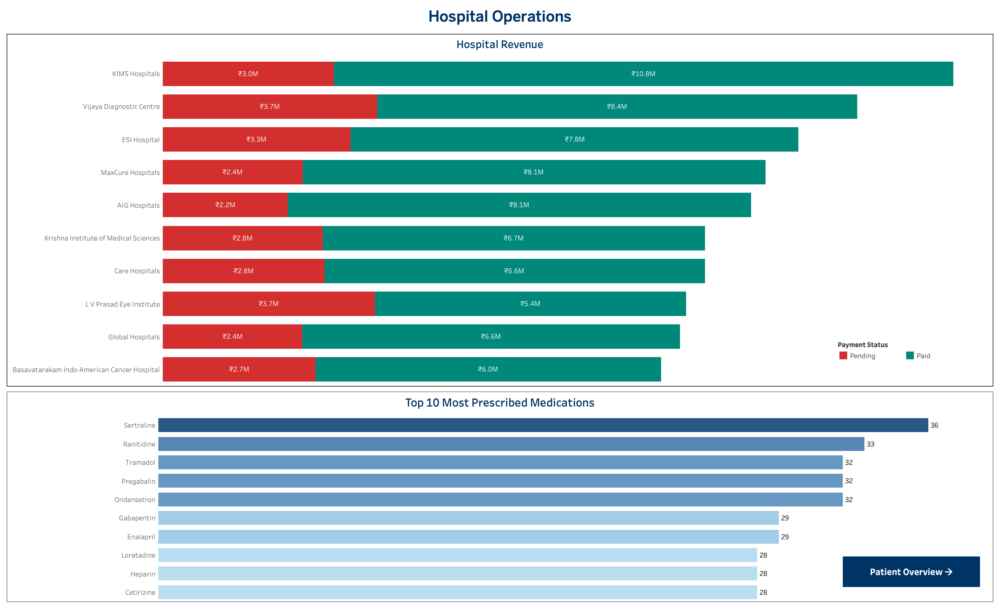

# Healthcare Patient Outcomes Analysis

🔗 **Live Interactive Dashboards (Tableau Public):**  
[View Dashboards](#) ← replace with your Tableau Public URL after publishing

---

## Executive Summary

Patient outcomes data across hospitals often sits fragmented across admission records, treatment logs, doctor notes, and billing systems — making it difficult for clinical and operations teams to see the full picture. This project consolidates that data into a single end-to-end analysis to surface where patients are struggling post-discharge, which treatments are working, and where hospital revenue is going uncollected.

Using SQL for data cleaning across 8 interconnected tables and Tableau for visualization, the project builds three interactive dashboards covering patient demographics and readmission patterns, clinical treatment outcomes and doctor performance, and hospital revenue and medication trends — giving both clinical and operational stakeholders a unified view of performance across 30 Hyderabad hospitals.

The intent is to replace guesswork with a clear, data-backed view — so hospital administrators and clinical leads can make faster, more confident decisions about where to intervene, what to fix, and where revenue is being left on the table.

---

## Business Problem

Hospital leadership observed that patients across Hyderabad facilities were being readmitted at rates consistently above the 20% industry benchmark, while clinical teams had no unified view to explain why. Leadership partnered with data and operations teams to investigate which diseases, treatment types, and discharge patterns were driving poor recovery outcomes — and whether gaps in post-discharge care, inconsistent clinical protocols, and unresolved billing were compounding the problem across hospitals.

---

## Methodology

- Exploratory Data Analysis (EDA)
- SQL Data Cleaning (8 cleaned views)
- Star Schema Data Modeling
- Healthcare KPI Analysis
- Interactive Dashboard Design (3 dashboards)

---

## Skills

- SQL (CTEs, CASE statements, subqueries, window functions)
- Tableau (calculated fields, table calculations, dual axis, reference lines, navigation)
- Data Cleaning & Validation
- Data Modeling (Star Schema — 8 tables)
- HEX Data Science Notebook
- Snowflake / DuckDB

---

## Results & Business Recommendations

### Results

### Dashboard 1 — Patient & Clinical Analytics

**Age Group Distribution**

The donut chart breaks down admissions across four age groups. The 36–55 group leads at 30.2%, followed by 56–70 at 27.2%, 70+ at 21.2%, and 18–35 at 21.4%. The 56+ population collectively accounts for nearly half of all admissions — a concentration of clinically complex patients who carry higher readmission risk and longer recovery timelines than any other group.

**Monthly Admission Trends**

The line chart tracks five admission types across 12 months. Emergency admissions are the highest and most volatile, peaking sharply in April before declining through summer. Elective admissions follow a stable second-highest pattern. Urgent admissions spike around June. Day Surgery and Maternity remain flat throughout the year. The April emergency surge is the most operationally significant signal — hospitals need to proactively scale staffing and bed capacity heading into Q1.

**Readmission Rate by Disease**

Every disease in the top 10 exceeds the 20% benchmark reference line — the highest being Other Diseases of Digestive System at 33.3%, followed by Other Soft Tissue Disorders (31.3%), Type 1 Diabetes (30.4%), and Heart Failure (30.0%). Even lower-severity conditions like Gastritis and Cholelithiasis sit at 25.0%. When all 10 diseases exceed benchmark, it points to a systemic gap in post-discharge care — not disease-specific failures.

---

### Dashboard 2 — Clinical Outcomes

**Treatment Outcomes**

The 100% stacked bar chart compares five treatment types across Recovered, Improved, and Deceased outcomes. Preventive leads recovery at 70.83% but shows a binary pattern — tiny Improved segment with 25% mortality. Surgical is the most balanced at 62.69% recovered. Medical shows the highest Improved share at 27.31%, indicating partial response. Diagnostic is the most concerning — lowest recovery at 55.79% and the highest mortality at 21.05%, the only type crossing the 20% mortality mark.

**Average Length of Stay by Severity**

Mild patients average 4.1 days, Moderate 4.2, and Severe 4.4 — a gap of just 0.3 days between least and most severe. Clinically, severe patients should stay meaningfully longer. This compressed difference suggests discharge decisions are not consistently aligned with severity, and is very likely a direct contributor to the high readmission rates seen in Dashboard 1.

**Top 10 Doctors by Recovery Rate**

Dr. Priya Rao (Neurology) achieves 100% recovery — 15 percentage points above the next highest performers. Dr. Swathi Joshi (Urology) follows at 84.6% and Dr. Aryan Chandra (Nephrology) at 81.8%. Radiology and Dermatology specialists cluster at the lower end between 76–77%. Neurology and Urology consistently outperform — their protocols should be documented and replicated across lower-performing departments.

---

### Dashboard 3 — Hospital Operations

**Hospital Revenue & Payment Status**

KIMS Hospitals leads total revenue at ₹13.8M with a manageable 22% pending ratio. Vijaya Diagnostic Centre carries ₹3.7M pending against ₹8.4M paid — a 31% pending ratio signaling a billing issue. L V Prasad Eye Institute is the most concerning — ₹3.7M pending against only ₹5.4M paid, meaning roughly 41% of its revenue is uncollected and sitting unrealized. Hospitals above a 30% pending ratio need immediate billing reconciliation.

**Top 10 Most Prescribed Medications**

Sertraline leads at 36 prescriptions, followed by Ranitidine (33) and a tight cluster of Tramadol, Pregabalin, and Ondansetron at 32 each. The drug mix spans antidepressants, pain medications, antiemetics, cardiovascular drugs, and antihistamines — reflecting a patient population managing a broad range of chronic and overlapping conditions. The prominence of Sertraline at the top alongside high chronic disease readmission rates may warrant a review of mental health co-morbidity protocols.

---

## Business Recommendations

- Implement structured post-discharge programs for the top 5 high-readmission diseases — particularly Type 1 Diabetes and Heart Failure — including follow-up calls, medication adherence checks, and scheduled reviews within 7 days of discharge
- Standardize Surgical and Preventive treatment protocols across all hospitals — Diagnostic treatments show the most room for immediate improvement given the 21% mortality rate
- Extend average length of stay for Severe-classified patients by 1–2 days to reduce the 30–33% readmission rates observed across top diseases
- Launch a monthly billing reconciliation process targeting hospitals with pending ratios above 30% — L V Prasad Eye Institute and Vijaya Diagnostic Centre should be prioritized
- Create a cross-departmental knowledge-sharing program led by Neurology and Urology specialists to transfer proven clinical protocols to lower-performing departments

---

## Next Steps

- Investigate whether readmission patterns differ by patient age group — the 70+ segment (21.2% of admissions) may face distinct post-discharge access challenges
- Analyze whether specific medication combinations correlate with better or worse recovery outcomes across treatment types
- Explore the April emergency admission spike further — may reflect seasonal disease patterns worth proactive operational planning for

